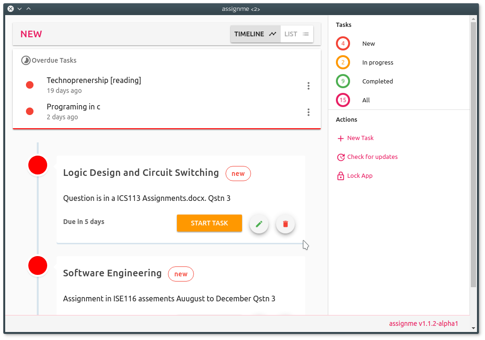

# assignme

 

Out of sheer frustration when I missed several assignments because I had forgotten, I decided to build assignme to be my reminder. It is still a young project and is yet to be given more features, but at its current state it is usable. You can benefit from this piece of software also. You could also help shape its future by suggesting new ideas or contributing with code.

[more screenshots](screenshots/readme.md)

### Milestones
- [x] Adding new task

- [x] Deleting a task

- [x] Editing a task

- [x] Starting and finishing a task

- [x] Sorting tasks in order of deadlines

- [ ] Markdown support to allow us to write comprehensive descriptions

- [ ] Native notifications for tasks that are almost due

- [x] Authentication

- [ ] Sync


### For those who want to engineer this app with me

Make sure you have [nodejs](http://nodejs.org) and [npm](npmjs) installed on your machine.

```bash
# clone the repository on to your local machine
git clone https://github.com/kudapara/assignme.git

# git will create a folder 'assignme'
# change your working directory to that folder
cd assignme

# install dependancies
npm install
```

When you have completed the above go ahead and follow the build setup below. Happy hacking.

#### Build Setup

``` bash
# install dependencies
npm install

# serve with hot reload at localhost:9080
npm run dev

# build electron application for production
npm run build


# lint all JS/Vue component files in `src/`
npm run lint

```

---

This project was created by [@kudapara](https://twitter.com/kudapara) using [electron-vue](https://github.com/SimulatedGREG/electron-vue)@[e04a5b5](https://github.com/SimulatedGREG/electron-vue/tree/e04a5b5f09f63265939e00c9dc59a612d9da5bc8) using [vue-cli](https://github.com/vuejs/vue-cli). Documentation about the original structure can be found [here](https://simulatedgreg.gitbooks.io/electron-vue/content/index.html).
